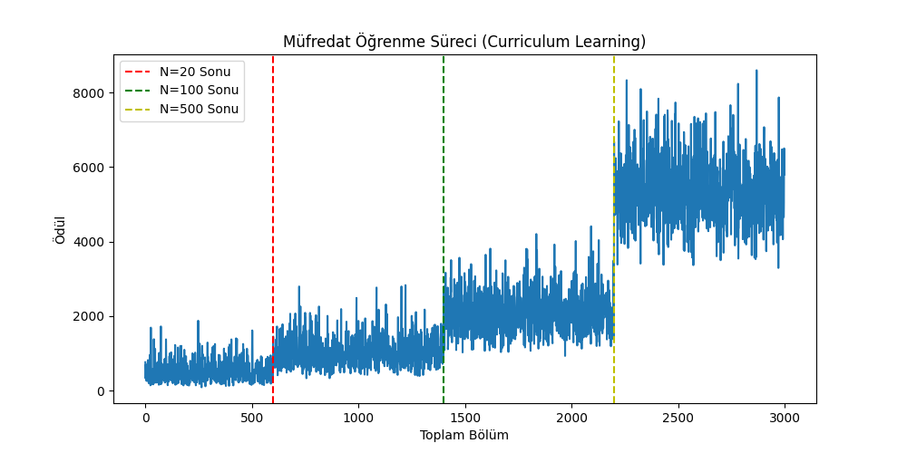
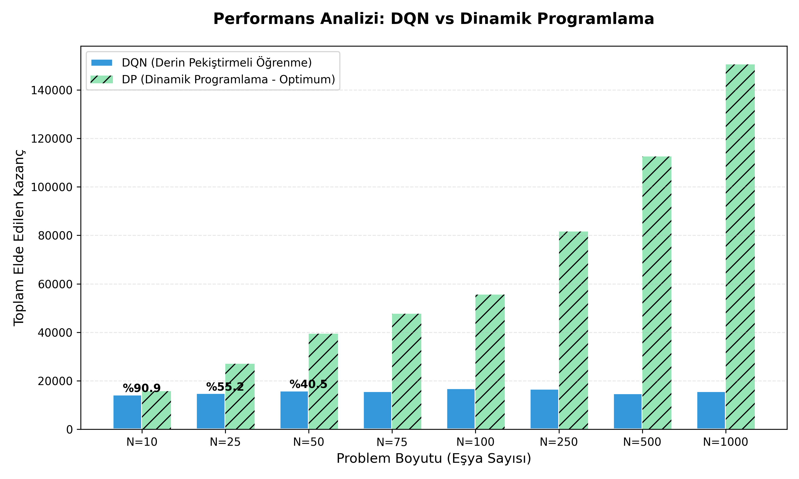
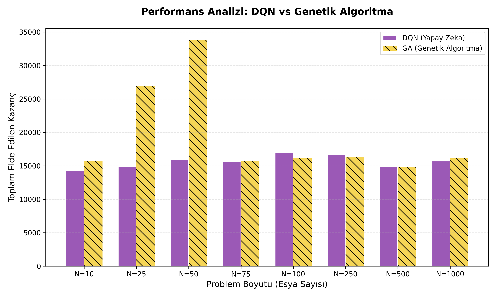
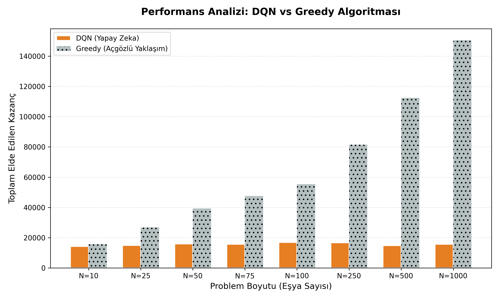
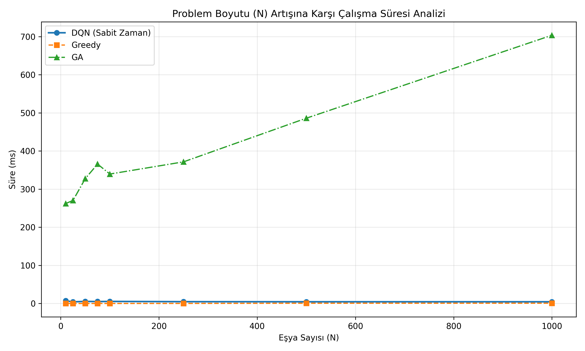
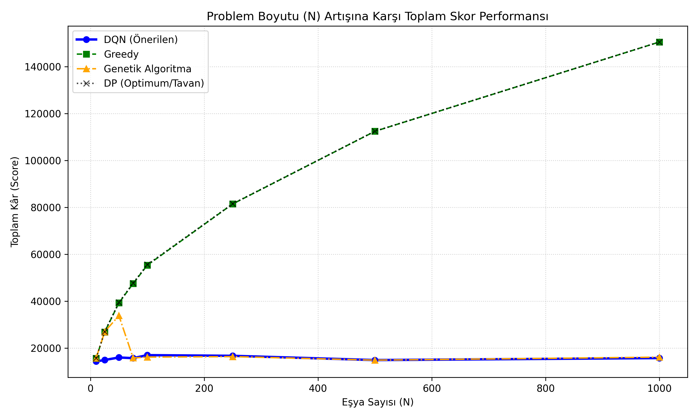

# 🎒 Knapsack DRL Optimization


Derin Pekiştirmeli Öğrenme (Deep Reinforcement Learning - DRL) tabanlı **Sırt Çantası (Knapsack)** Problemi Optimizasyonu ve Geleneksel Yöntemler (Greedy, Dinamik Programlama, Genetik Algoritma) ile Kapsamlı Başarım Analizi.

---

## 📖 Proje Hakkında

Bu proje, yöneylem araştırması ve bilgisayar bilimlerinin en bilinen NP-Hard problemlerinden biri olan **0-1 Sırt Çantası Problemini** (0-1 Knapsack Problem) çözmek için modern bir Yapay Zeka yaklaşımı sunar. PyTorch kullanılarak geliştirilmiş bir **Deep Q-Network (DQN)** ajanı ile problem çözülmüş ve klasik optimizasyon yöntemleri ile kapsamlı şekilde karşılaştırılmıştır.

Ajanın devasa durum uzayına (state space) sahip büyük problemlere adapte olabilmesi için **Müfredat Öğrenimi (Curriculum Learning)** ve özel **Ödül Şekillendirme (Reward Shaping)** metotları kullanılmıştır.

---

## ✨ Öne Çıkan Özellikler

- 🧠 **Deep Q-Network (DQN) Ajanı**: PyTorch ile geliştirilmiş, karar mekanizması sinir ağlarına dayanan zeki bir yapay zeka modeli.
- 📈 **Müfredat Öğrenimi (Curriculum Learning)**: Ajanın küçük problemlerde (N=20) öğrenmeye başlayıp, yavaş yavaş daha zor ve büyük problemlere (N=1000) geçiş yaparak eğitildiği kademeli eğitim mimarisi.
- 🎯 **Ödül Şekillendirme (Reward Shaping)**: Ajanın yalnızca değer maksimizasyonunu değil, aynı zamanda verimlilik (Değer/Ağırlık oranı) ve kapasite kullanımını da öğrenmesini sağlayan özel teşvik fonksiyonu.
- 📊 **Kapsamlı Analiz ve Benchmark**: Geliştirilen modelin Greedy, Dinamik Programlama (DP) ve Genetik Algoritma ile skor, hesaplama süresi ve ölçeklenebilirlik açısından kıyaslanması.

---

## 📂 Proje Yapısı

```bash
📦 Knapsack-DRL-Optimization
 ┣ 📜 agent.py           # DQN Ajanı, Replay Memory ve Eğitim döngüsü
 ┣ 📜 env.py             # Gym formatında Knapsack simülasyon ortamı
 ┣ 📜 train.py           # Curriculum Learning ile modelin eğitildiği ana betik
 ┣ 📜 baseline.py        # DP, Greedy ve Genetik Algoritma implementasyonları
 ┣ 📜 evaluate.py        # Eğitilmiş modeli test etme ve kıyaslama betiği
 ┣ 📜 data_parser.py     # Harici veri setlerini (benchmark) ayrıştırma modülü
 ┣ 📜 requirements.txt   # Proje bağımlılıkları listesi
 ┣ 📜 dqn_model.pth      # Eğitilmiş hazır model ağırlıkları (PyTorch)
 ┣ 📂 data/              # Veri setleri ve test verileri
 ┗ 📂 docs/              # Ek dökümantasyonlar ve notlar
```

---

## 🚀 Kurulum ve Kullanım

### Gereksinimler

Projeyi yerel ortamınızda çalıştırmak için aşağıdaki komut ile bağımlılıkları yükleyin:

```bash
pip install -r requirements.txt
```
> **Not:** Model eğitimi için `torch` (PyTorch) kullanılmaktadır. GPU (CUDA) destekli daha hızlı eğitim için cihazınıza uygun sürümü [PyTorch Resmi Sitesi](https://pytorch.org/get-started/locally/) üzerinden indirebilirsiniz.

### 1. Modeli Eğitmek (Training)

DQN ajanını mevcut müfredat öğrenimiyle sıfırdan eğitmek için:
```bash
python train.py
```
> Eğitim tamamlandığında ağ ağırlıkları `dqn_model.pth` dosyasına kaydedilir ve eğitim sürecini gösteren `ogrenme_egrisi_curriculum.png` grafiği ana dizinde oluşturulur.

### 2. Değerlendirme ve Analiz (Evaluation)

Eğitilmiş yapay zeka modelini test etmek ve Dinamik Programlama, Genetik Algoritma, Greedy gibi baseline yöntemlerle karşılaştırmak için:
```bash
python evaluate.py
```
> Bu betik; modellerin başarılarını, çalışma sürelerini ve artan veri boyutuna (N) göre ölçeklenebilirliklerini test eder ve sonuçları grafikler (png) halinde kaydeder.

---

## 📊 Analiz ve Bulgular

### 📈 Öğrenme Eğrisi (Curriculum Learning)
Eğitim sırasında aşamalı olarak (*N=20, 100, 500, 1000*) problem boyutu artırılır. Bu strateji ile ajanın, doğrudan büyük verilerle karşılaştığında yaşayacağı genelleme sorunu ve hafıza karmaşıklığı aşılmıştır.



### 🏆 Başarı (Değer) Karşılaştırmaları
Aşağıdaki grafikler, DQN modelinin klasik yaklaşımlara karşı test verileri üzerinde ürettiği toplam değer (Value) performansını göstermektedir:

| DQN vs Dinamik Programlama | DQN vs Genetik Algoritma | DQN vs Greedy |
| :---: | :---: | :---: |
|  |  |  |

> *Dinamik Programlama (DP) kesin optimal sonucu garanti ederken; DQN yaklaşımı, Genetik Algoritmadan daha iyi veya ona çok yakın, Greedy'den ise açık ara üstün bir şekilde optimal sonuca oldukça yakın (near-optimal) sonuçlar üretmiştir.*

### ⏱️ Ölçeklenebilirlik ve Zaman Karmaşıklığı
Veri seti boyutu arttıkça DP gibi deterministik yöntemlerin çalışma süreleri üssel olarak artarak donanım sınırlarına dayanmaktadır. Buna karşın, DQN modelinin çıkarım (inference) süresi devasa verilerde bile doğrusal/sabit **O(1) veya O(N)** zaman bandında kalarak üstün bir ölçeklenebilirlik sunar.

| Zaman Karmaşıklığı Analizi | Ölçeklenebilirlik Analizi |
| :---: | :---: |
|  |  |

---


